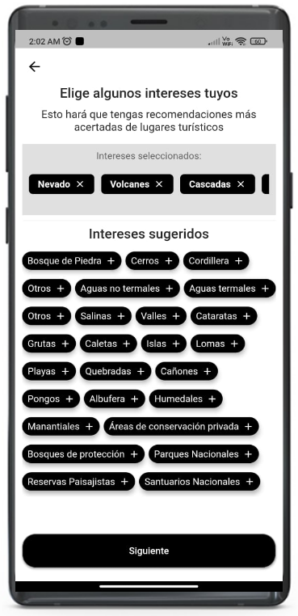
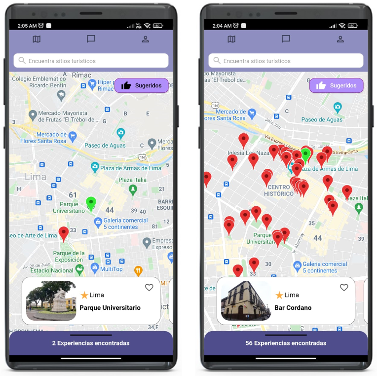
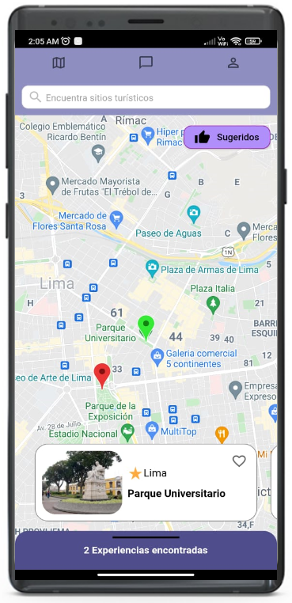
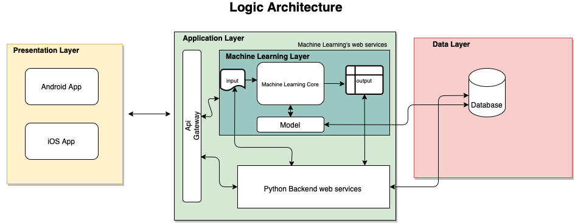
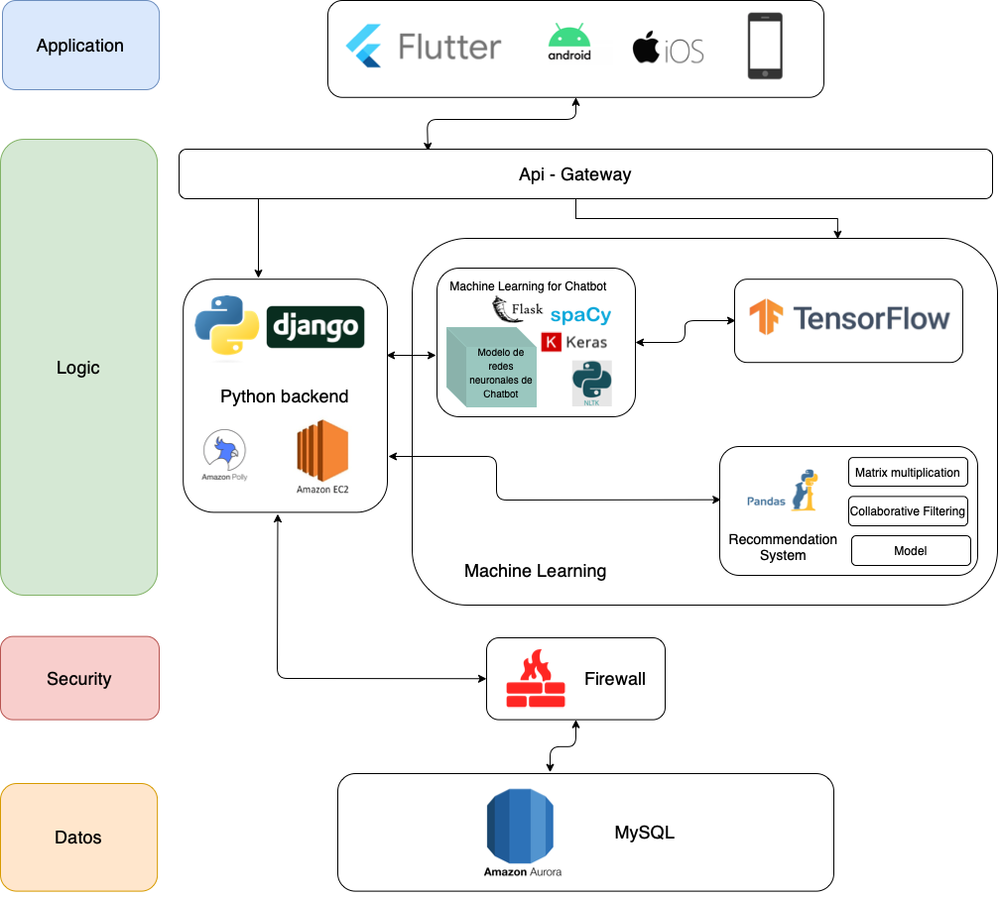

Alpakita: Your favorite tourism app ❤🦙
=======

## Description

Have you ever looked for tourist information in a forum or blog but hasn't convinced you? Then this app is for you 🤩. 

We help you in your tourist experience through a friendly and intuitive mobile application that will provide you with information and tourist recommendations in real time according to your tastes.

  
  
  

Architecture
--------
### Logic Architecture ###

  

A three-layer architecture has been proposed in order to be able to observe the system structure to a high level. The introductory layer, where the app will be incorporated in two operative systems, Android and IOS. The interaction within the system begins when the user makes information requests about tourist places, which uses the “Api Gateway” of the “App Layer” in order to determine if whether the request requires Machine Learning or it is as simple as a profile update, for example. In both cases, the web service will be used in order to attend the user’s request. And there will also be access to the “data layer”, which will contain the database, to transfer the request.

### Physical Architecture ###

  

A physical architecture in “n” layers has been proposed including App, Logic, Security, and Data. The architecture will be divided this way because the project will have different modules such as the app in Android and IOS, web services using Django Framework, the Machine Learning and Flask usage for the chat-bot development and the recommendation system, and the information storage through a database SQL. 
